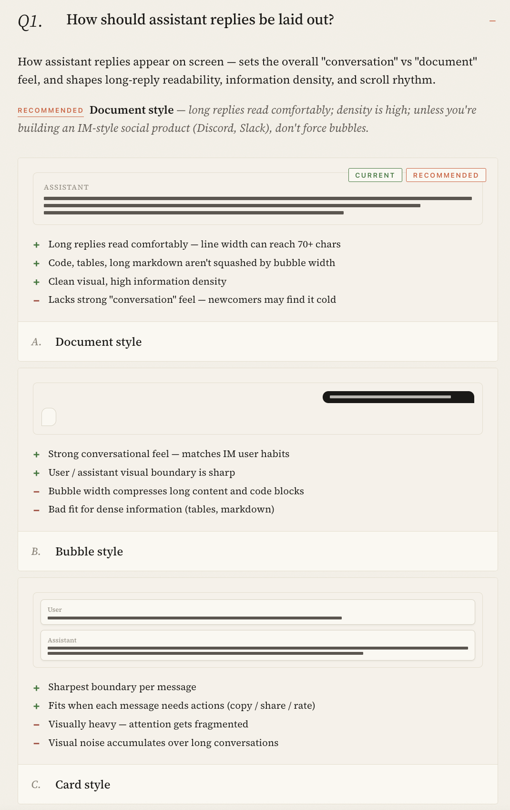

# grill-me-visual

[中文 →](./README.zh-CN.md)

> Visual design decisions you can see — pick from rendered options in your browser instead of describing them in chat.

[▸ Try the live demo](https://akiyax.github.io/skills/grill-me-visual/template.en.html)



## What this does

Some design decisions are awkward to make in text. *"Bubble vs document layout?", "exponential backoff or fallback model?", "Source Serif or Playfair for the wordmark?"* — you can describe the options in words, but you don't really know which one you want until you see them side by side.

`grill-me-visual` is a [Claude Code](https://docs.anthropic.com/en/docs/claude-code) skill that fires when Claude is about to ask you 3+ visually-shaped questions in a row. Instead of asking them in chat, it generates a **single-file HTML questionnaire** — opens in any browser, side-by-side previews per question (UI mockups, CSS animations, Mermaid diagrams, font samples, code snippets), recommended option marked, click to pick, copy the markdown summary back into chat. No build, no install, just one file.

## Install

```bash
npx skills add akiyax/skills --skill grill-me-visual -g -y
```

Ships with English and Chinese templates — Claude picks the one matching the language you're chatting in.

## Background

Inspired by [`mattpocock/skills` — `grill-me`](https://github.com/mattpocock/skills) — same relentless-grilling philosophy, but for the subset of decisions where a 3-sentence text question doesn't carry the weight of three thumbnails.

## License

MIT
