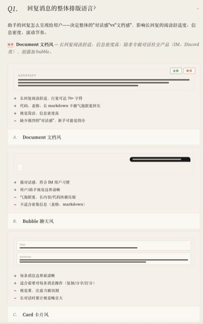

# grill-me-visual

<p align="center"><a href="./README.md">English</a> · <strong>中文</strong></p>

> *"没人确切知道自己想要什么。"*  
> — Thomas & Hunt,《程序员修炼之道》
>
> 尤其在看见之前。

<table>
<tr>
<th width="50%" align="left"><code>grill-me</code> — 对话框中 </th>
<th width="50%" align="left"><code>grill-me-visual</code> — 浏览器中 &nbsp; <a href="https://akiyax.github.io/skills/skills/grill-me-visual/template.zh.html">🚀 试一试</a></th>
</tr>
<tr>
<td valign="top">

**Q.** 回复消息的整体排版语言?

助手的回复怎么呈现给用户——决定整体的"对话感"vs"文档感",影响长回复的阅读舒适度、信息密度、滚动节奏。

**A. Document 文档风** — *推荐*

**B. Bubble 聊天风**

**C. Card 卡片风**

*推荐:* **Document 文档风** — 长回复阅读舒适、信息密度高;除非专做对话社交产品(IM、Discord 类),别强加 bubble。

</td>
<td valign="top">



</td>
</tr>
</table>

## 安装

**A. skills CLI**(推荐)

自动识别你正在用的 agent(Claude Code / Cursor / Codex / Gemini CLI / OpenCode 等)并安装到对应位置。

```bash
npx skills add akiyax/skills --skill grill-me-visual -g -y
```

**B. Claude Code plugin marketplace**

```
/plugin marketplace add akiyax/skills
/plugin install grill-me-visual@akiyax-skills
```


## 介绍

[`grill-me`](https://github.com/mattpocock/skills/blob/main/skills/productivity/grill-me/SKILL.md) 是一个极佳的 skill。但是，如果你在使用 [`grill-me`](https://github.com/mattpocock/skills/blob/main/skills/productivity/grill-me/SKILL.md) 或者  [`brainstorm`](https://github.com/obra/superpowers/blob/main/skills/brainstorming/SKILL.md)，你可能会遇到：

- 不知道Agent问的问题是什么意思
- 每个选项代表的含义也不清楚

特别是在UI/UX设计、流程或架构决策时，纯文本或ASCII图表的表现力明显不足。所以为什么不把问题放到HTML 中呢？

`grill-me-visual` 附带了 HTML 模板，并内置了 6 种问题类型

- **UI布局** —— 内联 HTML/CSS 的布局 / 容器 / 渲染样式对比
- **动画** —— `@keyframes` 实时动效演示
- **Mermaid** —— 流程图 / 时序图 / 状态图 / ER 图 / 类图
- **字体** —— 字体样本对比
- **代码** —— 同样渲染,不同内容
- **纯文本** —— 无需视觉决策的问题

你的Agent会先输出问题内容，然后为每个问题挑选模板，并创建一个HTML让你在浏览器中进行决策。

回答完毕后，你可以将所有问答粘贴回对话中继续讨论。

> [!WARNING]
> **这不是一个轻量 skill。** 尽管已经做了大量节约 token 的工作，agent 通常仍然需要几分钟才能创建完 HTML 文件。使用前请权衡这些决策是否值得时间/Token用量。
